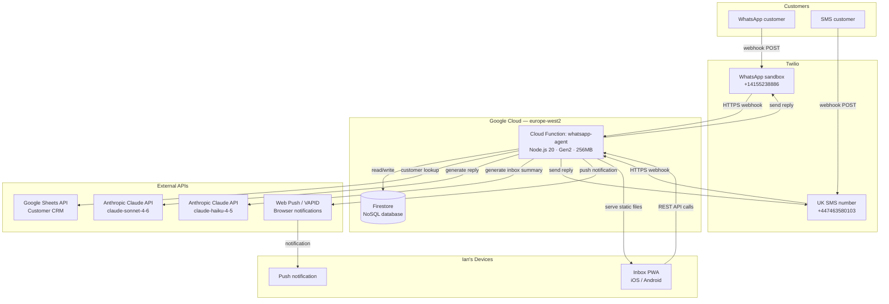
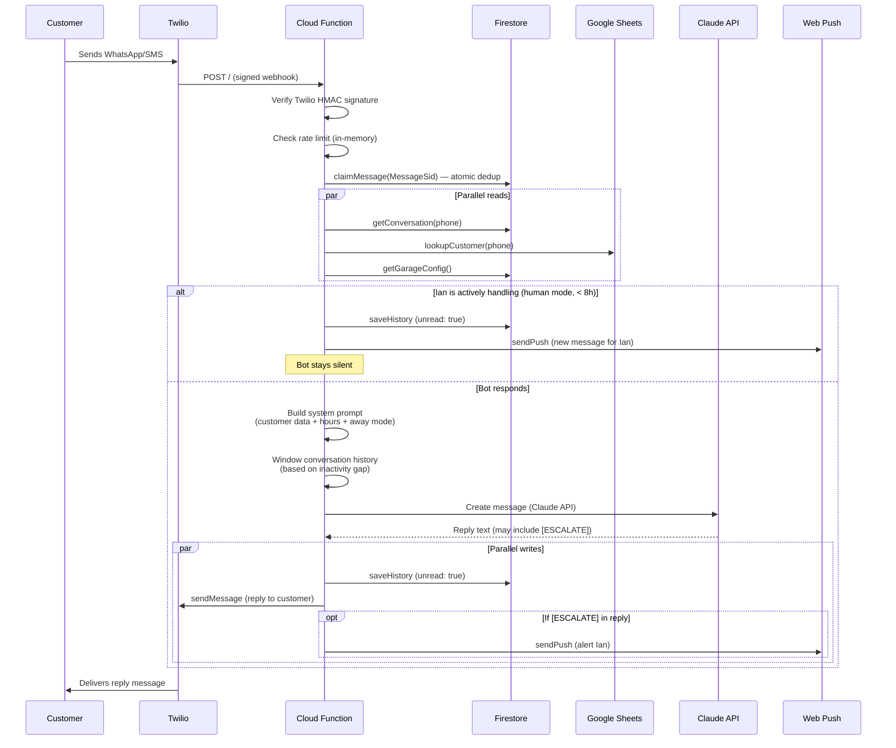
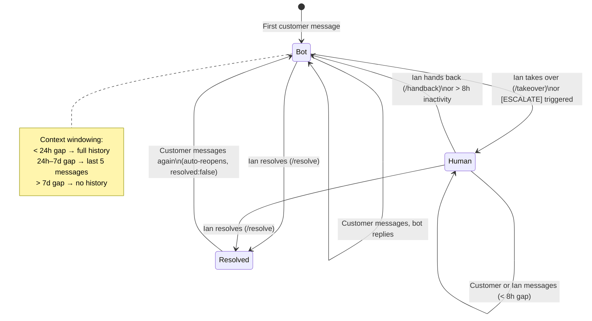
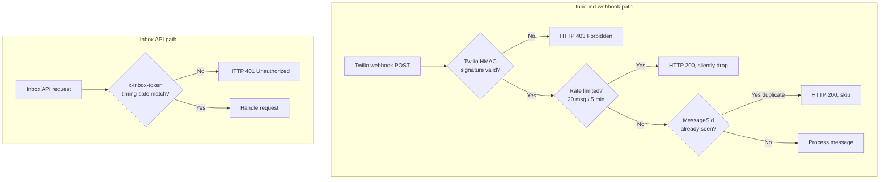
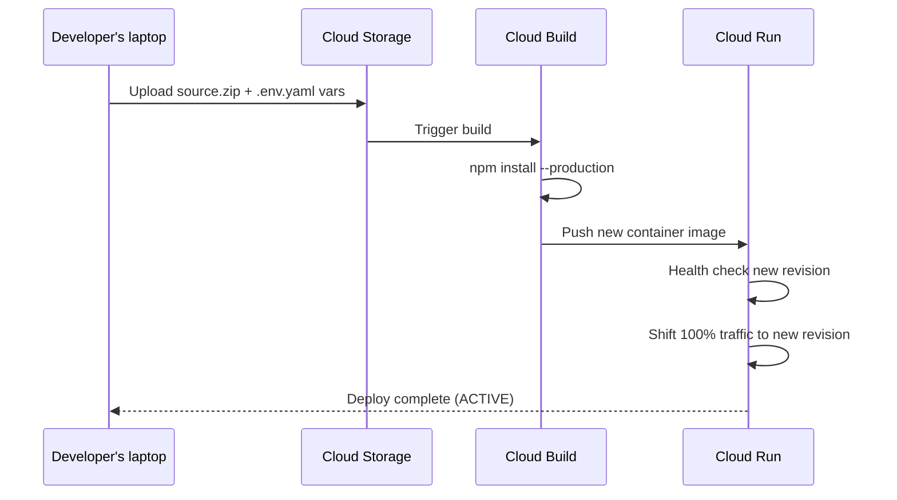

# CH Autoworks AI Assistant — Architecture

> Last updated: July 2026  
> Current revision: `whatsapp-agent-00034-sej`

---

## Table of Contents

1. [System Overview](#1-system-overview)
2. [High-Level Architecture](#2-high-level-architecture)
3. [Component Reference](#3-component-reference)
4. [Inbound Message Flow](#4-inbound-message-flow)
5. [Firestore Data Model](#5-firestore-data-model)
6. [Conversation State Machine](#6-conversation-state-machine)
7. [The Inbox PWA](#7-the-inbox-pwa)
8. [Credentials & Secrets](#8-credentials--secrets)
9. [Security Architecture](#9-security-architecture)
10. [Observability & Monitoring](#10-observability--monitoring)
11. [Billing & Cost Tracking](#11-billing--cost-tracking)
12. [Deployment](#12-deployment)
13. [Known Limitations & Future Work](#13-known-limitations--future-work)

---

## 1. System Overview

CH Autoworks AI Assistant is a WhatsApp and SMS customer service agent for CH Autoworks garage. Customers contact the garage by texting or WhatsApp-messaging a dedicated number; the AI handles the conversation automatically — taking MOT bookings, answering questions about pricing and services, diagnosing faults from symptoms, and escalating to Ian (the owner) when human judgement is needed.

Ian manages all active conversations through a mobile-first Progressive Web App (PWA) inbox hosted on the same server. He can read conversations, reply directly, take over from the bot, escalate, and mark conversations resolved. Push notifications alert him when a customer needs him specifically.

The system is fully serverless. There are no servers to manage — everything runs on Google Cloud.

---

## 2. High-Level Architecture



### Key design decisions

| Decision | Rationale |
|---|---|
| Single Cloud Function for everything | Simpler ops: one deploy, one set of logs, one billing item. Acceptable at this traffic volume. |
| Firestore for conversation storage | Schemaless — easy to add fields; atomic operations for message dedup; no connection management needed in serverless context. |
| Google Sheets as customer CRM | Ian already maintains a Sheets-based customer list for the MOT reminder system. Avoids duplicating data. |
| Claude-sonnet for conversations | Best balance of quality and cost for multi-turn customer conversations requiring nuanced judgement. |
| Claude-haiku for inbox summary | Summary is straightforward text processing; Haiku is ~12× cheaper and fast enough. |
| PWA served from same function | No CDN or separate hosting needed; keeps everything in one deployable unit. |

---

## 3. Component Reference

### `index.js` — HTTP router

The entry point. Wraps an Express.js app in the Google Cloud Functions Framework. All HTTP routes are defined here.

| Route | Auth | Purpose |
|---|---|---|
| `POST /` | Twilio signature | Inbound webhook: WhatsApp and SMS messages |
| `GET /health` | None | Liveness probe for uptime monitoring |
| `GET /inbox` | None | Serves the PWA static files |
| `GET /conversations` | INBOX_SECRET | Lists all conversations |
| `GET /conversations/:phone` | INBOX_SECRET | Fetches a conversation + marks it read |
| `POST /reply` | INBOX_SECRET | Ian sends a message to a customer |
| `POST /takeover` | INBOX_SECRET | Ian takes over a conversation from the bot |
| `POST /handback` | INBOX_SECRET | Returns control to the bot |
| `POST /resolve` | INBOX_SECRET | Marks a conversation resolved or reopens it |
| `GET /inbox-summary` | INBOX_SECRET | Generates today's AI summary card |
| `POST /daily-summary` | INBOX_SECRET | Sends the daily WhatsApp summary to Ian |
| `GET /garage-config` | INBOX_SECRET | Returns garage config (away mode etc.) |
| `POST /away` | INBOX_SECRET | Sets or clears Ian's away-mode return date |
| `GET /billing-summary` | INBOX_SECRET | Returns Claude API cost for a given month |
| `POST /billing-config` | INBOX_SECRET | Sets the billing markup percentage |
| `POST /subscribe` | INBOX_SECRET | Registers a Web Push subscription |
| `GET /vapid-public-key` | INBOX_SECRET | Returns VAPID public key for push setup |

---

### `handler.js` — Core message logic

Called for every inbound customer message. Orchestrates the full pipeline.

```
inbound message
    │
    ├─ claim MessageSid (dedup)
    ├─ parallel reads:
    │    ├─ getConversation(phone)    → Firestore
    │    ├─ lookupCustomer(phone)     → Google Sheets
    │    └─ getGarageConfig()         → Firestore (away mode)
    │
    ├─ check human takeover active?
    │    └─ yes → save message, notify Ian, STOP
    │
    ├─ calculate context window based on inactivity
    ├─ build system prompt (customer data + hours + away mode)
    ├─ call Claude API
    │
    ├─ check for [ESCALATE] flag in reply
    │
    └─ parallel writes:
         ├─ saveHistory (Firestore)
         ├─ sendMessage (Twilio)
         └─ sendPush (if escalated)
```

**Inactivity thresholds**

| Gap since last message | Behaviour |
|---|---|
| < 8 hours (`HUMAN_GRACE_HOURS`) | If Ian has taken over: bot stays silent, message saved for Ian |
| 8–24 hours | Bot resumes; full conversation history sent to Claude |
| 24 hours – 7 days (`NEW_CONVERSATION_HOURS`) | Bot treats as new-ish conversation; only last 5 messages sent to Claude as context |
| > 7 days (`FRESH_START_HOURS`) | Completely fresh start; no prior context sent to Claude |

Full message history is always preserved in Firestore. The context windowing only affects what Claude sees.

---

### `claude.js` — Anthropic API client

Thin wrapper around the Anthropic SDK. All Claude calls go through here.

- Default model: `claude-sonnet-4-6`
- `max_tokens`: 500 (keeps replies conversational and short)
- Timeout: 20 seconds
- Retries: up to 2 retries with exponential backoff (via `retry.js`) on network errors, 429, and 5xx
- Usage tracking: after every call, records `inputTokens`, `outputTokens`, and `costUSD` to Firestore `usage_monthly`

---

### `store.js` — Firestore data layer

All Firestore reads and writes go through this module.

| Function | Description |
|---|---|
| `getConversations()` | Lists all conversations ordered by `lastMessageAt` desc, limit 100 |
| `getConversation(phone)` | Full conversation doc including message history |
| `saveHistory(phone, messages, meta)` | Upserts the conversation doc with merge |
| `appendIanMessage(phone, content)` | Appends Ian's message to history, saves |
| `setStatus(phone, status)` | Sets `bot` or `human` |
| `setResolved(phone, resolved)` | Marks resolved/open |
| `markRead(phone)` | Sets `unread: false` |
| `clearHistory(phone)` | Deletes the conversation doc entirely |
| `claimMessage(sid)` | Atomically creates a `processed_messages` doc; returns false if already exists |
| `getGarageConfig()` | Reads `config/garage` |
| `setGarageConfig(data)` | Merges into `config/garage` |
| `recordUsage(model, in, out, cost)` | Increments monthly token counters |
| `getUsage(month)` | Returns `usage_monthly/YYYY-MM` |

---

### `sheets.js` — Customer CRM lookup

On every inbound message, queries the Google Sheets customer database by phone number.

- Reads columns A–G of the `Customers` tab
- Normalises phone numbers (converts `07xxx` → `+44xxx`) before comparing
- Returns customer name + array of vehicles (one row per vehicle, so customers with multiple cars get multiple rows)
- Failures are caught and logged; returns `null` on error so the bot continues without customer context
- No caching currently — live read on every message

**Sheet columns expected:**

| Col | Field |
|---|---|
| A | First name |
| B | Last name |
| C | Phone (UK format) |
| D | Registration |
| E | Make |
| F | Model |
| G | MOT expiry |

---

### `security.js` — Webhook authentication

Validates every inbound Twilio webhook using HMAC-SHA1 signature verification.

- Twilio signs requests with `TWILIO_AUTH_TOKEN` against the exact webhook URL
- The configured `TWILIO_WEBHOOK_URL` env var must match what's set in the Twilio console exactly
- Requests with missing or invalid signatures are rejected with HTTP 403
- URL is configured explicitly (rather than reconstructed from headers) because Cloud Run's proxy layer makes header-based URL reconstruction unreliable

---

### `rateLimit.js` — Abuse protection

In-memory sliding window rate limiter. Keyed per phone number.

- Limit: **20 messages per 5 minutes** per phone number
- Requests over the limit are acknowledged to Twilio (HTTP 200) but silently dropped
- State is in-memory only — resets on cold start, not shared across concurrent instances
- Protects against runaway message loops and deliberate abuse, but is not a hard guarantee

---

### `retry.js` — Exponential backoff

Used by `claude.js` and `twilio.js` for transient failure handling.

- Up to 2 retries (3 attempts total)
- Base delay: 500ms, doubled each retry (500ms → 1000ms)
- Retries on: network errors, `429 Too Many Requests`, `5xx Server Error`
- Fails fast (no retry) on `4xx` errors other than 429

---

### `push.js` — Web Push notifications

Sends push notifications to Ian's device when a customer needs attention.

- Uses the Web Push / VAPID standard
- Subscriptions stored in Firestore `push_subscriptions` collection
- Sends to all registered subscriptions in parallel (`Promise.allSettled`)
- Automatically removes expired or invalid subscriptions (HTTP 410/404 responses from push service)
- Currently triggered only on escalations (to avoid notification fatigue)

---

### `summary.js` — Inbox and daily summaries

Two separate summary functions:

**`getInboxSummary()`** — for the inbox card
- Window: conversations with activity **since midnight today** (Europe/London time, BST/GMT aware)
- Includes resolved conversations from today (not just open ones)
- Uses `claude-haiku-4-5-20251001` to generate a brief bullet-point summary
- Grouped into "Needs attention" and "Dealt with today" sections
- Returns `null` if no conversations yet today

**`sendDailySummary()`** — sent to Ian by WhatsApp
- Window: last 24 hours
- Sends a summary WhatsApp message to Ian's phone via Twilio
- Called by `POST /daily-summary` (intended to be triggered by Cloud Scheduler)

---

### `billing.js` — Cost tracking utilities

Utility functions for the billing/cost system:

- `computeCost(model, inputTokens, outputTokens)` — calculates USD cost based on hardcoded per-model token rates
- `buildBillingSummary(month, usage, markupPercent)` — formats the usage data with an optional markup percentage for invoicing
- `formatBillingEmail(summary)` — plain-text email format for monthly reports

**Current token pricing (USD/million):**

| Model | Input | Output |
|---|---|---|
| claude-sonnet-4-6 | $3.00 | $15.00 |
| claude-haiku-4-5 | $0.25 | $1.25 |

---

### `email.js` — Gmail sender

Simple nodemailer wrapper for sending emails (e.g. billing reports). Requires `GMAIL_USER` and `GMAIL_APP_PASSWORD` environment variables. Not currently wired to automated triggers.

---

## 4. Inbound Message Flow



---

## 5. Firestore Data Model

### Collection: `conversations`

Document ID: normalised phone number (e.g. `+447700900123`)

```json
{
  "customerName":  "Sarah Johnson",
  "phone":         "+447700900123",
  "status":        "bot",
  "escalated":     false,
  "resolved":      false,
  "unread":        true,
  "twilioNumber":  "+447463580103",
  "lastMessage":   "Great, I'll let Ian know — he'll confirm the exact time.",
  "lastMessageAt": "2026-07-06T10:34:00Z",
  "updatedAt":     "2026-07-06T10:34:00Z",
  "messages": [
    {
      "role":    "user",
      "content": "Hi, I need to book my MOT",
      "sender":  "customer",
      "ts":      "2026-07-06T10:30:00Z"
    },
    {
      "role":    "assistant",
      "content": "Hi there! I'm the AI assistant for CH Autoworks...",
      "sender":  "bot",
      "ts":      "2026-07-06T10:30:05Z"
    }
  ]
}
```

**`status` values:** `"bot"` (AI handling) | `"human"` (Ian handling)  
**`sender` values on messages:** `"customer"` | `"bot"` | `"ian"`  
**Max messages stored:** 200 (oldest trimmed when exceeded)

---

### Collection: `processed_messages`

Document ID: Twilio `MessageSid` (e.g. `SMxxxxxxxxxxxxxxxxxxxxxxxxxxxxxxxxxx`)

```json
{
  "processedAt": "2026-07-06T10:30:00Z"
}
```

Used for idempotency. Twilio may redeliver webhooks if it doesn't receive a fast HTTP 200. The `create()` operation is atomic — if the doc already exists Firestore throws `ALREADY_EXISTS` (code 6) and the duplicate is dropped.

---

### Collection: `push_subscriptions`

Document ID: base64(endpoint URL, first 64 chars)

```json
{
  "subscription": {
    "endpoint": "https://fcm.googleapis.com/fcm/send/...",
    "keys": {
      "p256dh": "...",
      "auth":   "..."
    }
  },
  "updatedAt": "2026-07-06T08:00:00Z"
}
```

---

### Collection: `config`

#### Document: `config/garage`

```json
{
  "awayUntil":            "2026-08-14",
  "billingMarkupPercent": 0
}
```

`awayUntil` is checked against the current time — if the date has passed, away mode is inactive even if the field is set (auto-expiry without needing to clear it manually).

---

### Collection: `usage_monthly`

Document ID: `YYYY-MM` (e.g. `2026-07`)

```json
{
  "totalCostUSD": 4.23,
  "updatedAt":    "2026-07-06T10:34:00Z",
  "models": {
    "claude-sonnet-4-6": {
      "requestCount":  312,
      "inputTokens":   421500,
      "outputTokens":  48200,
      "costUSD":       3.98
    },
    "claude-haiku-4-5-20251001": {
      "requestCount":  28,
      "inputTokens":   56000,
      "outputTokens":  8400,
      "costUSD":       0.25
    }
  }
}
```

Uses Firestore `FieldValue.increment()` for atomic counter updates — safe under concurrent requests.

---

## 6. Conversation State Machine



---

## 7. The Inbox PWA

Ian's inbox is a Progressive Web App served from the Cloud Function at `/inbox`.

### Architecture

```
Cloud Function
└── express.static('web/')
    ├── index.html      — single-page app shell
    ├── style.css       — WhatsApp-inspired mobile UI
    ├── app.js          — all client-side logic
    ├── sw.js           — service worker (push + offline shell)
    └── manifest.json   — PWA metadata (icon, theme, display mode)
```

### Features

- **Authentication:** password prompt on first load, stored in `localStorage`. Sent as `x-inbox-token` header on every API call.
- **Conversation list:** ordered by latest message, filterable (Open / Resolved / All). Unread conversations shown in bold with a green dot.
- **Conversation view:** full message thread with day dividers and sender labels (Bot / Ian / Customer). Scrolls to bottom on new messages; preserves position on background poll updates.
- **Ian's reply bar:** send a message directly from the inbox; reply is sent via Twilio and appended to Firestore.
- **Take over / Hand back:** Ian can swap control between himself and the bot mid-conversation.
- **Resolve / Reopen:** marks a conversation done; automatically reopens if the customer messages again.
- **Inbox summary card:** AI-generated daily overview (refreshes every 15 minutes; reloads when returning from a chat).
- **Away mode:** moon button in header. Sets a return date in Firestore; bot changes its behaviour automatically.
- **Push notifications:** requests permission on login; uses Web Push / VAPID to deliver escalation alerts even when the app is in the background.
- **Polling:** conversation list polls every 5 seconds when on the list screen; active chat polls every 5 seconds.

### Adding to home screen

- **Android:** Chrome → three-dot menu → "Add to Home screen"
- **iOS:** Safari → Share → "Add to Home Screen"

Once added, the PWA runs in standalone (full-screen, no browser chrome) mode.

---

## 8. Credentials & Secrets

### Where secrets are stored

| Secret | Stored in | Notes |
|---|---|---|
| `ANTHROPIC_API_KEY` | Cloud Function env vars | Set via `.env.yaml` on deploy |
| `TWILIO_ACCOUNT_SID` | Cloud Function env vars | |
| `TWILIO_AUTH_TOKEN` | Cloud Function env vars | Also used for webhook signature validation |
| `TWILIO_WEBHOOK_URL` | Cloud Function env vars | Must match Twilio console exactly |
| `TWILIO_WHATSAPP_NUMBER` | Cloud Function env vars | Twilio sandbox number (`+14155238886`) |
| `INBOX_SECRET` | Cloud Function env vars | Password for the inbox PWA |
| `VAPID_PUBLIC_KEY` | Cloud Function env vars | Sent to browsers for push setup |
| `VAPID_PRIVATE_KEY` | Cloud Function env vars | Never sent to browser |
| `GOOGLE_SHEET_ID` | Cloud Function env vars | Sheet ID, not secret — but kept consistent |
| `GARAGE_NAME` | Cloud Function env vars | |
| `GARAGE_PHONE` | Cloud Function env vars | |
| `GMAIL_USER` | Cloud Function env vars | Optional — for billing email |
| `GMAIL_APP_PASSWORD` | Cloud Function env vars | Optional — Gmail app password |

### Source of truth

All environment variables are defined in **`.env.yaml`** on the developer's laptop. This file is gitignored and never committed.

```yaml
# .env.yaml (gitignored — never commit)
ANTHROPIC_API_KEY: 'sk-ant-...'
TWILIO_ACCOUNT_SID: 'AC...'
# etc.
```

On deploy, the `--env-vars-file=.env.yaml` flag uploads these to the Cloud Run service configuration. They are visible in the GCP Cloud Console (Cloud Run → Service → Edit & deploy → Variables).

### Google Cloud authentication

The Cloud Function uses the **default Compute Service Account** (`129372070976-compute@developer.gserviceaccount.com`) for all GCP API calls (Firestore, etc.). No explicit credentials are needed in code — the runtime provides them automatically via Application Default Credentials. The service account has Firestore read/write permissions by default within the same GCP project.

Google Sheets access uses the same service account via the `google-auth-library` with scope `spreadsheets.readonly` — the sheet must be shared with this service account email.

### Recommended improvement

Environment variables in Cloud Run config are visible in the console and in `gcloud` output. The proper solution is **Google Secret Manager** — secrets are referenced by name rather than stored as values, access is audited, and rotation doesn't require a redeploy.

---

## 9. Security Architecture



### Controls in place

| Threat | Control |
|---|---|
| Forged webhook from attacker | Twilio HMAC-SHA1 signature validation on every inbound request |
| Replay attack / duplicate delivery | Atomic Firestore `create()` on MessageSid; fails if already seen |
| Message flooding / abuse | In-memory sliding window rate limiter (20 msg / 5 min per number) |
| Unauthorised inbox access | `x-inbox-token` header checked with `crypto.timingSafeEqual()` to prevent timing attacks |
| Credential exposure | `.env.yaml` gitignored; credentials stored as Cloud Run environment variables |
| CORS | CORS middleware enabled on all routes |
| Trust proxy | `trust proxy: true` set so IP and protocol headers from Cloud Run's load balancer are trusted correctly |

### Gaps / known risks

- Rate limiter is in-memory only — state is lost on cold start and not shared across concurrent instances. Under sustained attack from a single number, concurrent instances could each admit up to 20 messages before the number is fully blocked.
- Inbox password is a single shared secret. If compromised, all access is exposed. No per-user accounts, no session expiry.
- Credentials in Cloud Run env vars are visible to anyone with GCP project access.
- No WAF or DDoS protection beyond what Google's infrastructure provides by default.

---

## 10. Observability & Monitoring

### Logging

All `console.log()` and `console.error()` calls in the Node.js runtime are automatically captured by **Google Cloud Logging**. Structured JSON logs are visible in the GCP Console under Logs Explorer.

Key log events:

| Log message | Severity | When |
|---|---|---|
| `Duplicate delivery of {sid}` | INFO | Twilio webhook redelivery detected and dropped |
| `Rate limit hit for {phone}` | ERROR | Rate limiter triggered |
| `Rejected webhook with invalid Twilio signature` | ERROR | Possible forged webhook |
| `askClaude failed after retries` | ERROR | Claude API unavailable after 3 attempts |
| `Sheets lookup error` | ERROR | Google Sheets unavailable |
| `Daily summary sent to {twilioTo}` | INFO | Daily summary sent successfully |
| `recordUsage failed` | ERROR | Billing counter write failed (non-fatal) |

### Uptime monitoring

A `/health` endpoint returns `{"status":"ok"}` with HTTP 200. This is intended to be polled by **Google Cloud Monitoring Uptime Checks** (configured separately in the GCP Console). Alerting can be configured to notify via email or PagerDuty if the endpoint is unresponsive.

### Cost / usage monitoring

Claude API usage is tracked per model per month in `Firestore > usage_monthly`. Query via:

```
GET /billing-summary?month=2026-07
Authorization: x-inbox-token: {INBOX_SECRET}
```

Response:
```json
{
  "month": "2026-07",
  "claudeCostUSD": 4.23,
  "markupPercent": 0,
  "markupUSD": 0,
  "totalUSD": 4.23,
  "models": { ... }
}
```

GCP infrastructure costs (Cloud Functions invocations, Firestore reads/writes, egress) are tracked separately in the GCP Billing Console. At current traffic volumes (small garage), GCP costs are within or near the free tier.

### What's missing

- No distributed tracing (e.g. Cloud Trace)
- No error tracking / alerting service (e.g. Sentry, Datadog)
- No custom dashboards for message volume, response latency, or escalation rate
- No alerting on high Claude API spend

---

## 11. Billing & Cost Tracking

### Estimated monthly costs (typical small garage)

Assumes ~10–15 customer contacts/day, ~3 messages each.

| Component | ~Monthly cost |
|---|---|
| Claude Sonnet (customer replies) | £8–12 |
| Claude Haiku (inbox summaries, 15-min refresh) | £1–2 |
| Twilio inbound SMS (~600 msgs) | £4 |
| Twilio outbound SMS (~600 msgs) | £18 |
| Twilio number rental | £1 |
| Google Cloud Functions / Firestore | ~£0 (free tier) |
| **Total** | **~£32–37/month** |

### Cost reduction opportunities

1. **WhatsApp Business API direct** — Meta charges per 24h conversation window: free for first 1,000/month. Removes Twilio outbound cost for WhatsApp traffic.
2. **Cheaper SMS provider** — Twilio outbound UK is ~$0.04/message. Plivo/Vonage charge ~$0.02. Halves the SMS line.
3. **Google Sheets caching** — Currently makes a live Sheets API call on every inbound message. Caching in Firestore (refresh hourly) removes this dependency and reduces latency.

---

## 12. Deployment

### Deploy command

```bash
npm run deploy
# expands to:
gcloud functions deploy whatsapp-agent \
  --gen2 \
  --region=europe-west2 \
  --runtime=nodejs20 \
  --trigger-http \
  --allow-unauthenticated \
  --entry-point=whatsappWebhook \
  --env-vars-file=.env.yaml
```

### What happens on deploy



- Previous revision is kept but receives 0% traffic — can be manually promoted for rollback
- Deploy typically takes 3–5 minutes
- Zero downtime — Cloud Run shifts traffic only after the new revision passes its health check

### Infrastructure details

| Property | Value |
|---|---|
| GCP Project | `trans-invention-392414` |
| Function name | `whatsapp-agent` |
| Region | `europe-west2` (London) |
| Runtime | Node.js 20 |
| Memory | 256 MB |
| CPU | 0.1666 vCPU |
| Timeout | 60 seconds |
| Max instances | 100 |
| Concurrency | 1 request per instance |
| Trigger | HTTP (unauthenticated — auth handled in-app) |

### Environment requirements

The developer's laptop needs:
- `gcloud` CLI authenticated with a GCP account that has Cloud Functions Developer role
- `.env.yaml` present in the project directory (not committed to git)
- Node.js 20+ for local testing

---

## 13. Known Limitations & Future Work

### Current limitations

| Area | Limitation |
|---|---|
| **Secrets** | Credentials stored as Cloud Run env vars — visible in GCP Console and `gcloud` deploy output. Proper solution: Google Secret Manager. |
| **Rate limiting** | In-memory only — not shared across concurrent instances, resets on cold start. |
| **Customer CRM** | Live Google Sheets call on every message — adds ~300–500ms latency; single point of failure. |
| **No staging environment** | All changes deploy directly to production. A mistake goes live immediately. |
| **WhatsApp** | Still on Twilio sandbox (`+14155238886`). Needs Meta Business verification and WhatsApp Business API setup to use Ian's number directly. |
| **Single inbox password** | No per-user accounts, no session expiry, no MFA. |
| **Data retention** | Conversations stored indefinitely in Firestore. No automated deletion or GDPR data retention policy. |
| **Billing** | Twilio costs not tracked in the billing system — only Claude API costs are recorded. |

### Planned improvements

- [ ] Google Secret Manager for credential storage
- [ ] WhatsApp Business API (direct Meta, remove Twilio for WhatsApp)
- [ ] Google Sheets caching layer in Firestore
- [ ] GDPR / data retention: auto-delete conversations older than 12 months
- [ ] Staging environment (separate GCP project or Cloud Function revision)
- [ ] Cloud Scheduler wired to `/daily-summary` for automatic end-of-day summary
- [ ] Error alerting via Cloud Monitoring on `console.error` log entries
- [ ] Cheaper UK SMS provider (Plivo / Vonage) to halve SMS costs
